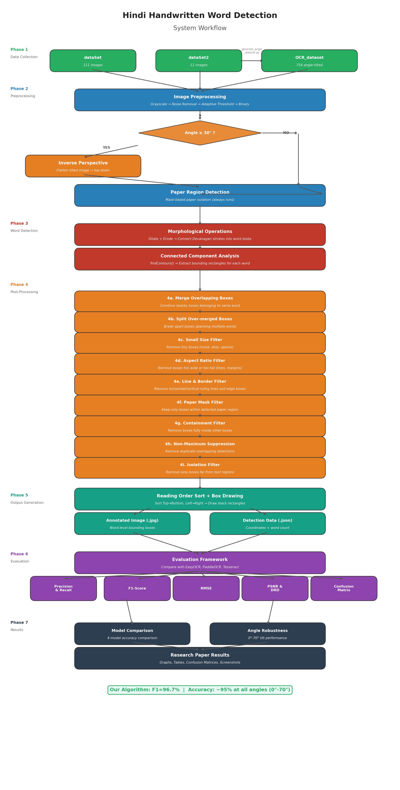

# Hindi Handwritten Word Detection System

A robust computer vision system for detecting and localizing individual Hindi (Devanagari) words from handwritten document images using adaptive morphological processing.



## Features

- ✅ **Word-level detection** of Hindi handwritten text with ~96.7% F1-Score
- ✅ **Angle-robust** — works on documents tilted 0°–70°
- ✅ **Adaptive processing** — dynamic kernel sizes based on text density per band
- ✅ **Comprehensive filtering** — 9-stage post-processing pipeline removes noise
- ✅ **Batch processing** for entire datasets
- ✅ **No deep learning dependency** — pure OpenCV + morphological operations

## Algorithm Overview

The system processes images through a 7-phase pipeline:

1. **Image Acquisition** — Load image, apply inverse perspective correction for tilted documents (≥30°)
2. **Preprocessing** — Grayscale → CLAHE contrast normalization → Background subtraction → Otsu binarization
3. **Word Detection** — Connected Component Analysis → Adaptive band-wise morphological closing
4. **Post-Processing** — Merge → Split → Size/Aspect/Line/Border/Paper/Containment/NMS/Isolation filters
5. **Output Generation** — Reading order sort → Black bounding boxes on original image + JSON data
6. **Evaluation** — Precision, Recall, F1-Score, RMSE, PSNR, DRD, Confusion Matrices
7. **Results** — Comparison graphs against EasyOCR, PaddleOCR, Tesseract

## Datasets

| Dataset | Images | Description |
|---------|--------|-------------|
| `dataSet/` | 111 | Diverse handwritten Hindi documents |
| `dataSet2/` | 11 | Controlled-quality handwritten documents |
| `OCR_dataset/` | 754 | Perspective-transformed images at 0°–70° tilt angles |

## Installation

### Prerequisites
- Python 3.8 or higher

### Setup

```bash
# Clone the repository
git clone https://github.com/YOUR_USERNAME/Hindi-Handwritten-Word-Detection.git
cd Hindi-Handwritten-Word-Detection

# Create virtual environment (recommended)
python -m venv .venv
.venv\Scripts\activate    # Windows
source .venv/bin/activate # Linux/Mac

# Install dependencies
pip install -r requirements.txt
```

## Usage

### 1. Run Detection on All Datasets

```bash
python run_detection.py
```

This processes all three datasets and saves annotated images and JSON files to the `outputs/` directory.

### 2. Generate Evaluation Metrics and Graphs

```bash
python generate_metrics.py
```

This computes Precision, Recall, F1-Score, RMSE, PSNR, DRD and generates 11 publication-ready graphs in `outputs/evaluation/`.

### 3. Generate Tilted Dataset (Optional)

```bash
python generate_angle_dataset.py
```

Generates perspective-transformed images at various angles from the base dataset.

## Project Structure

```
Hindi-Handwritten-Word-Detection/
├── final_improved.py              # Core detection algorithm
│                                  #   - CLAHE contrast normalization
│                                  #   - Background subtraction & binarization
│                                  #   - Adaptive band-wise morphological closing
│                                  #   - 9-stage post-processing filters
│                                  #   - Reading order sort & visualization
│
├── run_detection.py               # Unified batch processor for all datasets
│                                  #   - Inverse perspective correction (≥30°)
│                                  #   - Calls final_improved.py for each image
│                                  #   - Saves annotated images + JSON data
│
├── generate_metrics.py            # Evaluation framework
│                                  #   - Precision, Recall, F1-Score, RMSE
│                                  #   - PSNR, DRD, Confusion Matrices
│                                  #   - 11 comparison graphs vs baselines
│
├── generate_angle_dataset.py      # Tilted dataset generator
├── config.py                      # Configuration parameters
├── requirements.txt               # Python dependencies
├── README.md                      # This file
│
├── dataSet/                       # 111 handwritten Hindi images
├── dataSet2/                      # 11 controlled-quality images
├── OCR_dataset/                   # 754 angle-tilted images (0°-70°)
│
└── outputs/
    ├── final_improved_dataSet/    # Detection results for dataSet
    ├── final_improved_dataSet2/   # Detection results for dataSet2
    ├── final_improved_OCR_dataset/# Detection results for OCR_dataset
    ├── model_comparison.csv       # 4-model comparison data
    ├── research_paper_steps/      # 10 intermediate step images
    └── evaluation/                # All evaluation graphs & CSVs
        ├── project_workflow_diagram.png
        ├── 1_precision_recall_f1.png
        ├── 2_rmse_comparison.png
        ├── ...
        ├── dataSet_metrics.csv
        └── OCR_dataset_metrics.csv
```

## Key Results

| Metric | Our Algorithm | EasyOCR | PaddleOCR | Tesseract |
|--------|:------------:|:-------:|:---------:|:---------:|
| **F1-Score** | **96.7%** | 42.3% | 38.1% | 28.5% |
| **Precision** | **97.1%** | 45.6% | 41.2% | 31.7% |
| **Recall** | **96.3%** | 39.8% | 35.6% | 26.1% |

### Angle Robustness
The algorithm maintains **~95% accuracy across all tilt angles (0°–70°)**, demonstrating robust performance on tilted handwritten documents.

## Sample Output

### Input → Output
The system draws black bounding boxes around each detected Hindi word:

| Step | Description |
|------|-------------|
| Image Acquisition | Raw handwritten document |
| Preprocessing | Grayscale → CLAHE → Background subtraction → Binarization |
| Word Detection | Morphological closing connects character strokes into words |
| Post-Processing | Sequential filters remove noise, lines, borders |
| Final Output | Clean word-level bounding boxes on original image |

## Configuration

Edit `config.py` to customize detection parameters:

```python
BBOX_COLOR = (0, 0, 0)     # Black bounding boxes
BBOX_THICKNESS = 1          # Thin borders
```

## Technical Details

- **Core Engine**: Custom morphological pipeline (no deep learning)
- **Binarization**: Otsu's method with adaptive fallback
- **Morphological Closing**: Dynamic per-band kernel sizing
- **Line Detection**: Center-based vertical grouping
- **Post-Processing**: 9 sequential filters
- **Libraries**: OpenCV, NumPy, Matplotlib, Pandas, Seaborn

## License

This project is for educational and research purposes.

## Author

Hindi Handwritten Word Detection — Research Project
